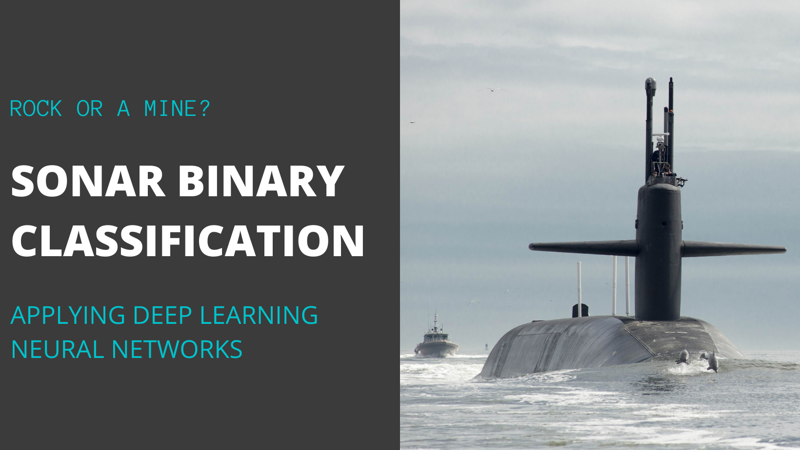

# Sonar Binary Classification
**Libraries Used:** pandas, numpy, sklearn, tensorflow/keras, matplotlib
A deep neural network was used to classify an object as either rock or a mine (metal) using sonar data. The final trained model 

## Project Overview 

**Goal:**
* Practice using tensorflow and keras for deeplearning. 
* I chose this dataset because it is frequestly cited in published papers on machine learning. 
Reading some of the papers I can get an understanding of some teqniques used and a benchmark on good model performcance. For example, [this paper's](https://www.ijsr.net/archive/v9i1/ART20203916.pdf) best model was was a boosted forest with 88% accuracy.

The data source can be found [here](https://archive.ics.uci.edu/ml/datasets/Connectionist+Bench+(Sonar,+Mines+vs.+Rocks))

Data Set Information:

> The file "sonar.mines" contains 111 patterns obtained by bouncing sonar signals off a metal cylinder at various angles and under various conditions. The file "sonar.rocks" contains 97 patterns obtained from rocks under similar conditions. The transmitted sonar signal is a frequency-modulated chirp, rising in frequency. The data set contains signals obtained from a variety of different aspect angles, spanning 90 degrees for the cylinder and 180 degrees for the rock.
> 
> Each pattern is a set of 60 numbers in the range 0.0 to 1.0. Each number represents the energy within a particular frequency band, integrated over a certain period of time. The integration aperture for higher frequencies occur later in time, since these frequencies are transmitted later during the chirp.
>
> The label associated with each record contains the letter "R" if the object is a rock and "M" if it is a mine (metal cylinder). The numbers in the labels are in increasing order of aspect angle, but they do not encode the angle directly.

**Results and Takeaways:** 

## Methodology

