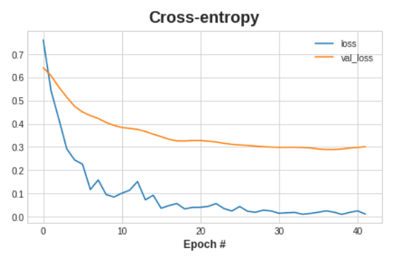

# Sonar Binary Classification
**Libraries Used:** pandas, numpy, sklearn, tensorflow/keras, matplotlib

A multilayer perceptron (MLP) artificial neural network was used to discriminate between sonar signals bounced off a metal cylinder and those bounced off a roughly cylindrical rock. The final model was 87.5% accurate on a test set.

## Project Overview 

**Goal:**
* Practice using tensorflow and keras for deeplearning. 
* Practice a classification problem.

**Data Set Information:**

> The file "sonar.mines" contains 111 patterns obtained by bouncing sonar signals off a metal cylinder at various angles and under various conditions. The file "sonar.rocks" contains 97 patterns obtained from rocks under similar conditions. The transmitted sonar signal is a frequency-modulated chirp, rising in frequency. The data set contains signals obtained from a variety of different aspect angles, spanning 90 degrees for the cylinder and 180 degrees for the rock.
> 
> Each pattern is a set of 60 numbers in the range 0.0 to 1.0. Each number represents the energy within a particular frequency band, integrated over a certain period of time. The integration aperture for higher frequencies occurs later in time, since these frequencies are transmitted later during the chirp.
>
> The label associated with each record contains the letter "R" if the object is a rock and "M" if it is a mine (metal cylinder). The numbers in the labels are in increasing order of aspect angle, but they do not encode the angle directly.

The data source can be found [here](https://archive.ics.uci.edu/ml/datasets/Connectionist+Bench+(Sonar,+Mines+vs.+Rocks))

## Results and Takeaways:

* This dataset has been cited in published papers on machine learning. Reading some of the papers we can get an understanding of some techniques used and typical accuracy achieved. For example, [this paper’s](https://www.ijsr.net/archive/v9i1/ART20203916.pdf) best model was a boosted forest with 88% accuracy. This is comparable to 87.5% achieved with the neural network. 

The model chosen had 2 hidden layers with 256 fully connected neurons. It also had batch normalization and dropout layers. The architecture of the final model is below.
||
|:--:| 
| *Neural Network Architecture*|

## Methodology

**Investigation**

* There are 111 mine data points and 96 rock data points. This is roughly a 50/50 distribution so binary accuracy was used as a performance metric. If the classes were imbalanced then F1-score would have been a better option.

**Preprocessing**

* The output column contained strings M or R. This was encoded as 0 or 1 using sklearn label encoder.
* The data was also scaled using sklearn standard scale for improved stability with stochastic gradient descent (SGD). SGD is the most common way to optimize neural networks.
* Data was split into train, validation, and test sets at around a 72-13-15 split.

**Model building** 

* Two dense hidden layers with 256 neurons each was used in the final model. 
* There is a lot of debate on optimal NN architecture including how many hidden layers to include and their size (how many neurons). A general rule is that a single hidden layer is often sufficient for most applications and additional layers may only provide marginal performance. In addition, the optimal size of the hidden layer is often between the size of the input and size of the output layers. Since we have 60 features and outputting 1, that would mean neutrons between 1-60. By going beyond this we can ensure the NN has enough 'capacity' to represent the relationships present and include some precautions to prevent overfitting.
* Rectified linear units (ReLU) was used as activation functions and a sigmoid function for a binary output.
* Batch normalization layers were used. This is beneficial because stochastic gradient descent will shift the network weights in proportion to how large an activation the data produces. Features that tend to produce activations of very different sizes can make for unstable training behavior. 
* Dropout layers were used. Dropouts help prevent overfitting which often occurs when the model learns spurious patterns. A network will often rely on very a specific combination of weights when modeling these spurious patterns. Being so specific, they tend to be fragile and removing one causes the spurious pattern to fall apart.
* Adam optimizer was used, a stochastic gradient descent algorithm that has an adaptive learning rate. Adam is a great general-purpose optimizer.
* Cross-entropy as a loss function to optimize. Accuracy cannot be used as a 'smooth' function is required.
* Early stopping was used using a callback function. A callback function stops training when the loss function stops decreasing (seen in cross-entropy graph below)

||
|:--:| 
| *Validation and training accuracy vs number of times the NN has been trained (Epoch)*|
|
| *Loss vs Epoch* |

**Next Steps**
* The neural network parameters could likely be tuned further for increased accuracy performance. 
* Depending on the application, computation cost could also be improved. Due to the smaller dataset however it is already fairly quick.
